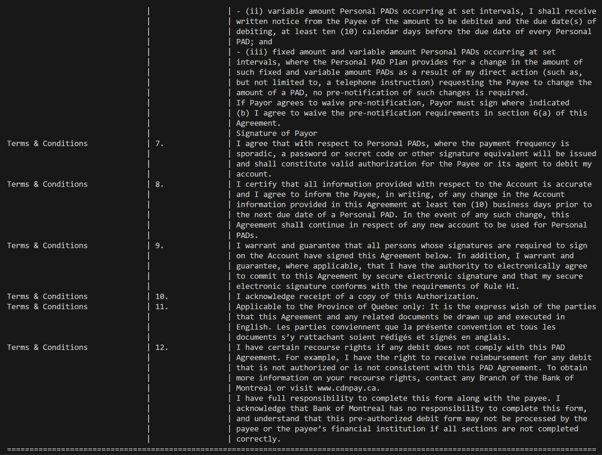

# How to Use This PDF Parsing Tool

See requirements.txt for what needs to be imported for code to work.

I did not include my own api key due to security reasons. \
steps to get api key: https://docs.cloud.llamaindex.ai/llamacloud/getting_started/api_key \
input api key in .env file next to LLAMA_CLOUD_API=llx-(key)

to run code input into console: 

*pip install -r requirements.txt*

*python tool.py 3360.pdf*

or: 

*python tool.py pdf/path*  (pdf/path is the path to the pdf you want to parse.)

This script will parse every pdf document accurately.

I converted the PDF into Markdown, and my code processes it to extract sections, subsections, and content.

I also have an open-source solution that doesn't require API calls, but it does need an LLM installed locally due to the document's complexity. Unfortunately, I don't have the storage or GPU support to run it on my machine.

Here is a example of the output when putting in 3360.pdf:

